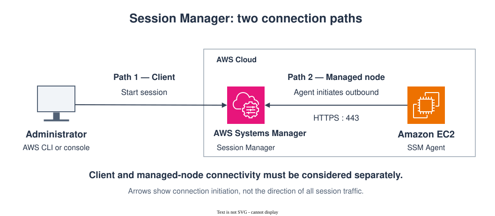
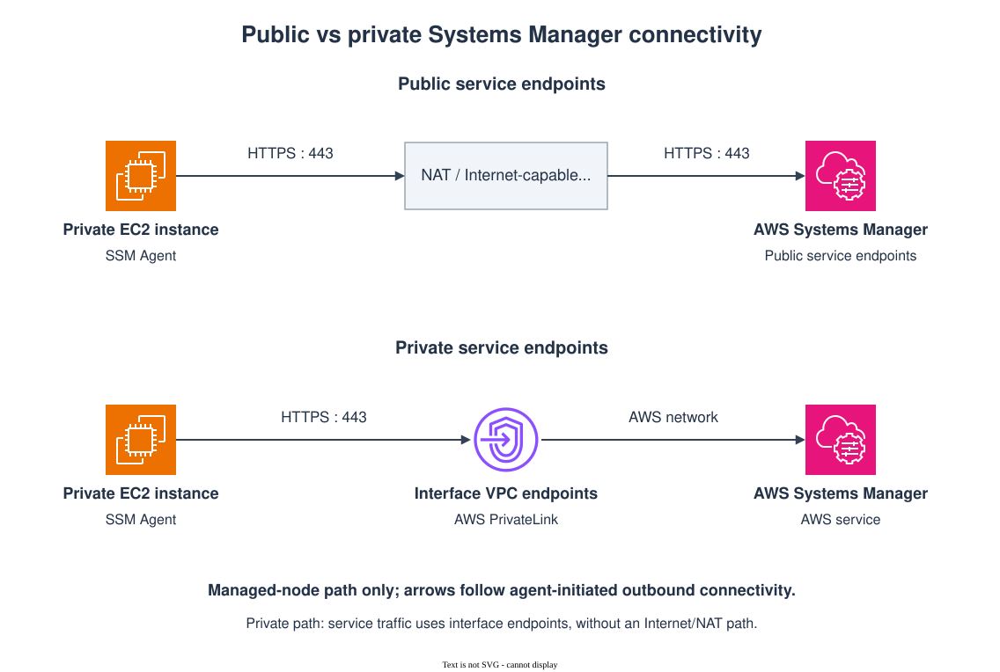

# Secure Private Administrative Access to AWS Workloads

Administrative access is necessary even in well-automated cloud environments. Engineers still need a controlled way to troubleshoot an instance, investigate an application issue, reach a private database, or perform an operational task.

The architecture question is not simply **how to connect to a server**. It is how to provide that access without unnecessarily exposing workloads, distributing long-lived credentials, or creating another infrastructure component that must be secured and operated.

This page looks at that problem in AWS and uses **AWS Systems Manager Session Manager** as the primary access pattern.

## The access problem

A traditional administrative path often starts with SSH or RDP:

See the [administrative access comparison](#using-systems-manager-as-the-access-layer) below.

This can be a valid design, especially where existing operational tooling depends on SSH or RDP, but it introduces additional concerns. The bastion becomes an entry point that must be patched, monitored, hardened, scaled, and protected. SSH keys or other host credentials also need their own lifecycle.

Private network connectivity such as a VPN or AWS Direct Connect can remove the need to expose the bastion publicly, but it does not remove the bastion itself or the host-level access model.

Another approach is to separate **administrative access** from **direct inbound network access to the workload**.

## Using Systems Manager as the access layer

AWS Systems Manager Session Manager provides controlled access to managed nodes without requiring inbound SSH or RDP ports.

At a high level, the pattern looks different from a traditional bastion:

The EC2 instance runs the SSM Agent and is registered as a Systems Manager managed node. The agent initiates outbound connections to Systems Manager, so a normal Session Manager connection does not require an inbound SSH rule on the instance.

This changes an important security boundary. Instead of deciding who can reach TCP port 22 and then authenticating at the operating system, access to the session can be controlled through AWS identity and authorization.

That does not make network design irrelevant. The administrator and the managed node still need connectivity to the AWS services involved in establishing and carrying the session.

## There are two sides to the connection

It is useful to think about a Session Manager connection as two related paths.

**Path 1 — Administrator to the AWS service**

The administrator starts the session through the AWS console, CLI, SDK, or another supported client. The client must be able to reach the AWS service endpoints used to establish the session.

**Path 2 — Managed node to the AWS service**

SSM Agent establishes outbound connectivity from the managed node to Systems Manager. For Session Manager, the `ssm` and `ssmmessages` service endpoints are particularly important. Exact endpoint requirements can vary with Region, SSM Agent version, and the Systems Manager capabilities being used, so current AWS documentation should be checked when implementing the design.

The distinction between these paths becomes important when the requirement changes from:

> “Do not allow inbound SSH to the EC2 instance.”

to:

> “Administrative connectivity must not depend on the public Internet.”

Those are different requirements.

## Internet-connected design

The simplest deployment can allow the required Systems Manager traffic to use AWS public service endpoints.

For the managed node, this commonly means outbound HTTPS connectivity through the VPC's Internet/NAT path.

Conceptually:

See the [public and private connectivity comparison](#making-the-managed-node-path-private) below.

The instance can remain in a private subnet and still use Session Manager without accepting inbound SSH. A NAT-based outbound path, however, means the Systems Manager communication is not using private VPC endpoints.

For many environments this may be acceptable. For others, security or network requirements call for the management path to remain on private connectivity.

## Making the managed-node path private

AWS PrivateLink interface VPC endpoints can provide private connectivity from the VPC to Systems Manager services.

The pattern becomes:

With the appropriate interface endpoints and DNS configuration, the managed node can communicate with Systems Manager without requiring an Internet gateway or NAT device for that traffic.

This improves the network posture of the managed-node side of the design, but it leads to an important question:

> If the EC2 instance uses private Systems Manager endpoints, is the administrator's Session Manager connection also private?

Not necessarily.

## Private workload access and private service access are different decisions

An administrator might be connected to the enterprise network while the EC2 instance communicates with Systems Manager through PrivateLink. Whether the administrator also reaches the relevant AWS service endpoints privately depends on the enterprise connectivity, DNS, routing, and endpoint design.

A private enterprise path might use technologies such as:

- AWS Site-to-Site VPN
- AWS Client VPN, depending on the access model
- AWS Direct Connect
- centralized or distributed interface VPC endpoints
- Route 53 Resolver for hybrid DNS resolution

Each solves a different part of the problem.

A VPN or Direct Connect can provide network reachability into AWS. An interface VPC endpoint provides private IP addresses through which a supported AWS service can be reached. DNS determines which endpoint address the client actually resolves. Routing determines whether the client can reach that address. Security groups control permitted network flows, while IAM determines whether the authenticated identity is authorized to start the session.

Having one of these pieces does not automatically provide the others.

## Port forwarding extends the pattern

Session Manager can also be used as a transport for port forwarding.

This is useful when an administrator needs access to a private resource that should not itself be exposed to the administrator's network.

For example:

The database remains private. The EC2 instance acts as the managed node through which the session reaches the remote host, while normal DNS resolution and network connectivity from that managed node to the database still apply.

This can be useful for controlled database administration and troubleshooting without exposing the database publicly or maintaining a traditional inbound SSH path.

## Security boundaries remain separate

A private network path is only one part of the architecture.

A complete design still needs to consider:

- **Identity** — Who is the administrator?
- **Authorization** — Which managed nodes and session types can that identity use?
- **Network access** — Which systems can reach the required endpoints and downstream resources?
- **Workload permissions** — What AWS permissions does the managed node itself require?
- **Session controls** — What session behavior should be permitted?
- **Auditability** — How are session activity and related API actions recorded?
- **Encryption** — What protections apply to the session and any related logs or data?
- **Operations** — How will failed agent, endpoint, DNS, routing, or authorization paths be diagnosed?

Treating these as separate controls makes troubleshooting easier as well. A successful TCP connection does not prove IAM authorization, and a correct IAM policy does not fix a broken DNS or routing path.

## Architecture decision

Session Manager is a strong fit when the goal is to reduce direct administrative exposure of workloads and control access through AWS identity and management services.

PrivateLink can additionally remove the managed node's dependency on Internet/NAT connectivity for supported Systems Manager traffic.

For environments that require the **entire administrative path** to remain private, however, creating VPC endpoints is only part of the solution. The administrator-side path, DNS resolution, enterprise connectivity, routing, endpoint placement, and security controls must be considered together.

That end-to-end private path is where the design becomes more interesting—and is the subject of the corresponding deep dive.

## Related AWS documentation

- AWS Systems Manager — Session Manager
- AWS Systems Manager — VPC endpoints and AWS PrivateLink
- AWS Systems Manager — `ssmmessages` and `ec2messages` endpoint behavior
- AWS Systems Manager — Starting port-forwarding sessions
